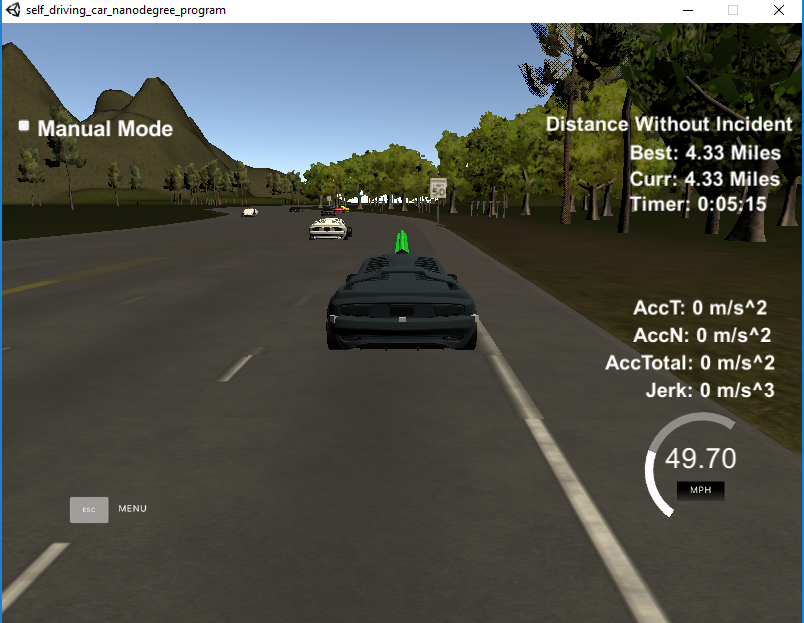

# CarND-Path-Planning-Project
Self-Driving Car Engineer Nanodegree Program
   
## Goals
The goal of this project is to design a path planner that is able to create smooth, safe paths for the car to follow along a 3 lanes highway with traffic that is driving 10MPH to 50MPH speed limit. The car will try to pass slower traffic when possible in order to reach as close as 50 MPH speed limit. The car should be able to complete on loop around about 4.32 miles withour accident as well as driving inside of the road lane. Also the car should not experience total acceration over 10 m/s^2 and jerk that is greater than 10 m/2^3

## Valid Trajectories
### The car is able to drive at least 4.32 miles without iccedent
The simulator image captuted below shows that the car can complete 4.32 miles without iccedent within about 5:15 minutes.

### Following the speed limit, max acceration and jerk rules
The car nevers run over speed limit 50 MPH and does not exceed a total acceleration of 10 m/s^2 and a jerk of 10 m/s^3.

### Car does have not collisions
The most important thing is safety, so the car does not have collisions after more than 10 miles driving. The car always keep stay in the lane except when it need to change lane.

### Car is able to change lane
In order to complete 4.32 miles within about 5:15 minutes, the car has to change lane smoothly to run faster.

## Reflection
Based on the provided code from the project Q&A lesson, I implemented more code about prediction, behavior planning in order to make the car run faster and safer.
### Prediction and behavior planning
Based on sensor fusion data, I can detect the orther nearby cars and predict the future position of these cars. When detecting the front car is closed to our car about 30m, I put the car to the finite state machine in order to decide which action should do next.
Belong to the current car lane, there are from 3 to 4 states that the car need to consider: KEEP FOLLOWING, CHANGE LANE LEFT (apply for middle lane and right lane), CHANGE LANE RIGHT (apply for middle lane and left lane) and KEEP FOLLOWING WITH REDUCED SPEED. In order to decide which state is choosen, I implemented the cost function that contains two main cost factore: effective and safety.
#### The effective cost function
The effective cost function is calculated based on the speed of the in front of car (if have) of the target lane. The faster of the in front of car, the smaller of the effective cost function. In case of there is NO in front of car, the effective cost function will be 0.
#### The collision cost function
The collision cost function is calculated based on the distance between our car and the front car and the distance between our car and the following car. The smaller of distance, the bigger of the collision cost function.
### Trajectory
The trajectory function is based on the output lane and speed of behavior planing phase in addition of car cordinators and previous path points. I have followed the code on Project Q&A lession that is using the spline with previous path points in order to create a car trajectory smoothly and avoid jerk.

